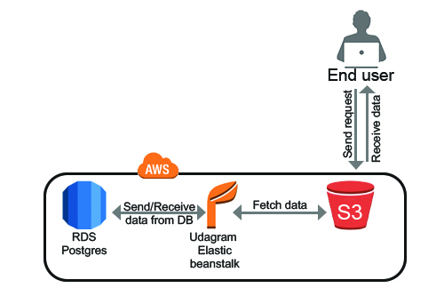

### AWS Cloud Setup




- RDS - Database Host: database-1.ckmiegisejgd.us-east-1.rds.amazonaws.com
- RDS - Database Port: 5432
- RDS - Database Name: database-1

- S3 - Frontend: http://udgram-1.s3-website-us-east-1.amazonaws.com/

- EB URL - Backend: http://udagram-api-dev.eba-8xzp53jb.us-east-1.elasticbeanstalk.com/

## Environment Variables

```
- PORT                = 8080
- POSTGRES_HOST       = <Database_IP_Address>
- POSTGRES_PORT       = <Database_Port>
- POSTGRES_DB         = <Database_Name>
- POSTGRES_USERNAME   = <Database_Username>
- POSTGRES_PASSWORD   = <Database_Password>
- URL                 = <Url>
- JWT_SECRET          = <Any_PassPhrase>
- AWS_REGION          = <us-east-1>
- AWS_PROFILE         = <Profile>
- AWS_BUCKET          = <Bucket_Name>
```

