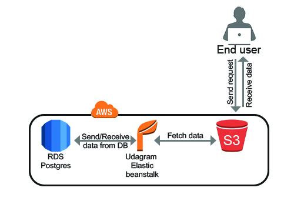

# Udagram Dependencies

1. Node v14.15 or higher.
2. npm: Lastest version or more recent.
3. A RDS database running Postgres.
4. AWS S3 bucket for Frontend.
5. A EB for hosting api code.
6. AWS EB CLI
7. AWS CLI v2

### AWS Cloud Setup




- RDS - Database Host: database-1.ckmiegisejgd.us-east-1.rds.amazonaws.com
- RDS - Database Port: 5432
- RDS - Database Name: database-1

- S3 - Frontend: http://udgram-1.s3-website-us-east-1.amazonaws.com/

- EB URL - Backend: http://udagram-api-dev.eba-8xzp53jb.us-east-1.elasticbeanstalk.com/

## Environment Variables

```
- PORT                = 8080
- POSTGRES_HOST       = <Database_IP_Address>
- POSTGRES_PORT       = <Database_Port>
- POSTGRES_DB         = <Database_Name>
- POSTGRES_USERNAME   = <Database_Username>
- POSTGRES_PASSWORD   = <Database_Password>
- URL                 = <Url>
- JWT_SECRET          = <Any_PassPhrase>
- AWS_REGION          = <us-east-1>
- AWS_PROFILE         = <Profile>
- AWS_BUCKET          = <Bucket_Name>
```

## Pipeline

From the root of the project:

- `npm run frontend:install` - To install frontend dependencies.
- `npm run frontend:build` - To build the Angular/Frontend.
- `npm run frontend:deploy` - To deploy the project to S3 using `./udagram-frontend/bin/deploy.sh` deploy script.
- `npm run backend:install` - To install backend dependencies.
- `npm run backend:change-main` - To change the main entry point in the package.json from `src/server.js` to `server.js` using `./udagram-api/bin/edit-main-entry.sh` with the help of jq and sponge.
- `npm run backend:build` - To transpile the Typescript/Backend.
- `npm run backend:aws-eb` - To Install AWS-EB using `./udagram-api/bin/aws-eb.sh` install script.
- `npm run backend:deploy` - To deploy the project to EB using `./udagram-api/bin/deploy.sh` deploy script.

## CircleCi

The order of the run jobs:

- Setting Env Variables.
- Install NodeJS.
- Checkout Code & Cloning the Repo.
- Install AWS CLI v2.
- Check & Disable AWS pager.
- Configure AWS AccessKeyID.
- Configure AWS Region.
- Frontend:
  - Install dependencies.
  - Build the angular.
  - Deploy the site to AWS S3.
- Backend:
  - Install dependencies.
  - Change The main entry point in package.json.
  - Transpile the typescript/ build the app.
  - Install AWS Elastic Beanstalk CLI.
  - Deploy the app to AWS Elastic Beanstalk.
